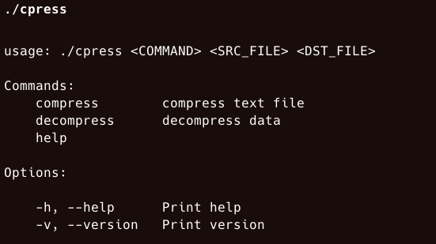

# Compression tool
This tool written in C is a simple compression tool inspired in https://codingchallenges.fyi/challenges/challenge-huffman/




### Features

- Huffman encode and decode implementation
- Bits manipulation for compact storage
- Handling of UTF-8 characters.

### Data Structures

- Binary tree is used to build Huffman tree
- Priority queue is implemented to select nodes with minor frequency.
- Hash table is used to storage and search characters prefix code quickly.

### Installation

1. Clone repo


```bash
git clone git@github.com:berracode/compression_tool_in_c.git
cd compression_tool_in_c
```

2. Compile project using make

```bash
make
```

### Usage

#### Compresion

```bash
./cpress compress /path/to/plain.txt  /path/to/compressed.bin
```

#### Decompression

```bash
./cpress decompress /path/to/compressed.bin  /path/to/plain.text
```


## Valgrind command

```sh
valgrind --leak-check=full --track-origins=yes ./cpress compress ./test_files/victor.txt
```
